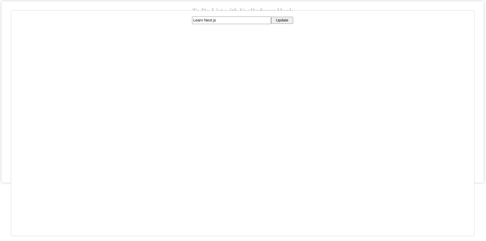
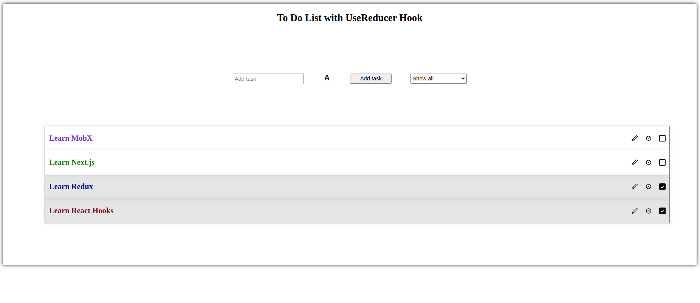

# _ToDoListWithUseReducerHook_

#### _Version 1_
#### _Date 01/6/2021_
#### By _**Adilet Momunaliev**_

## Description

_ToDoListWithUseReducerHook creates tasks , shows tasks based on undo and done property of a tasks, edits task, deletes task, selects tasks based on done or undone._

## Getting Started

These instructions will get you a copy of the project up and running on your local machine for development and testing purposes.

### Instruction

* Node js in your local machine
* git clone
* npm install
* npm run start
### Specifications
 ;
 ;
 ;
## Technologies Used

_HTML, CSS, JavaScript,Async functions,React Hooks, IDE Atom, React-Modal, React-Toast. React-ColorPicker_

### License

*_Copyright (c) 2020 **Adilet Momunaliev**_*
